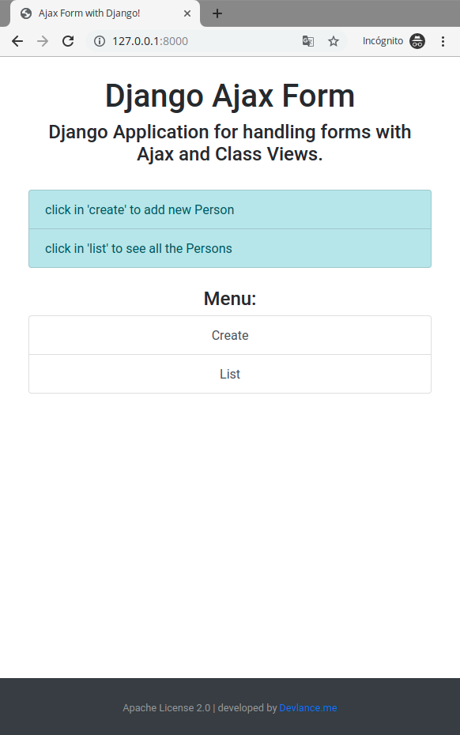
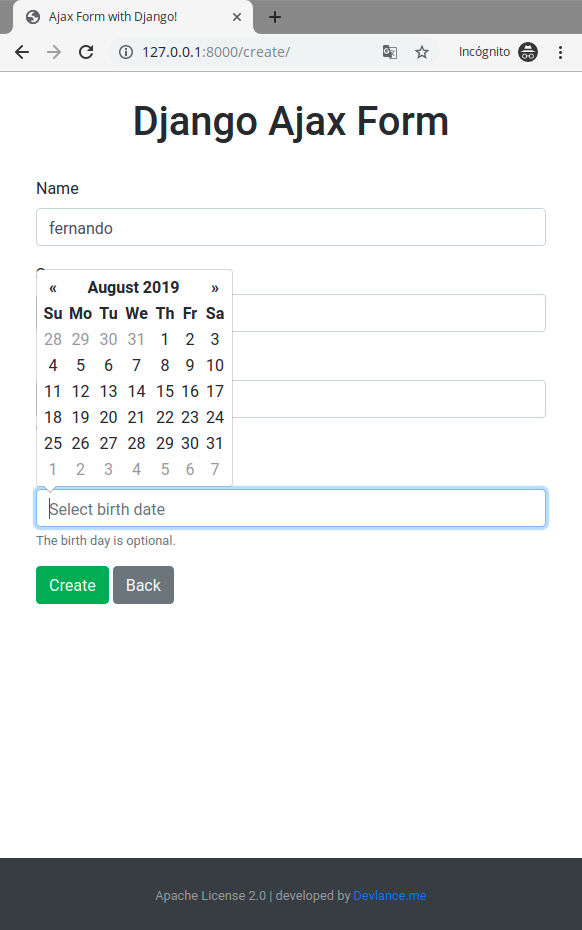
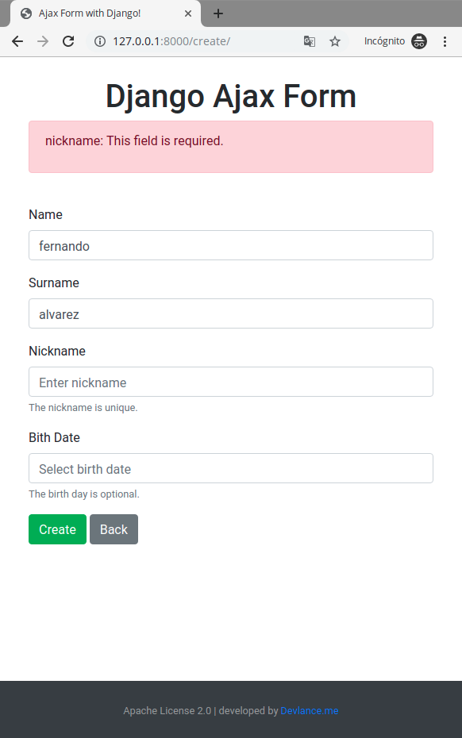
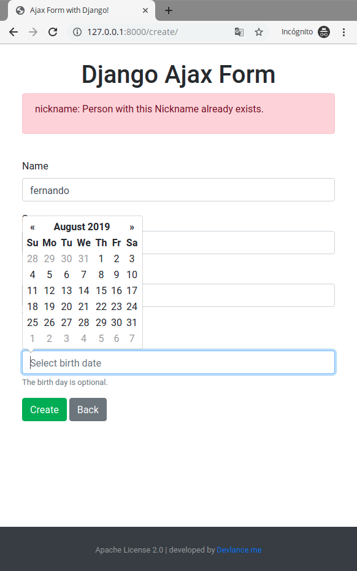
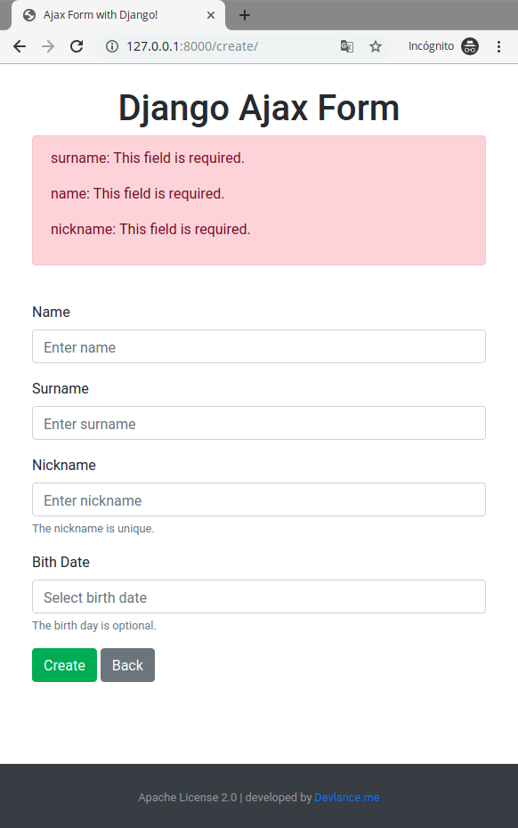
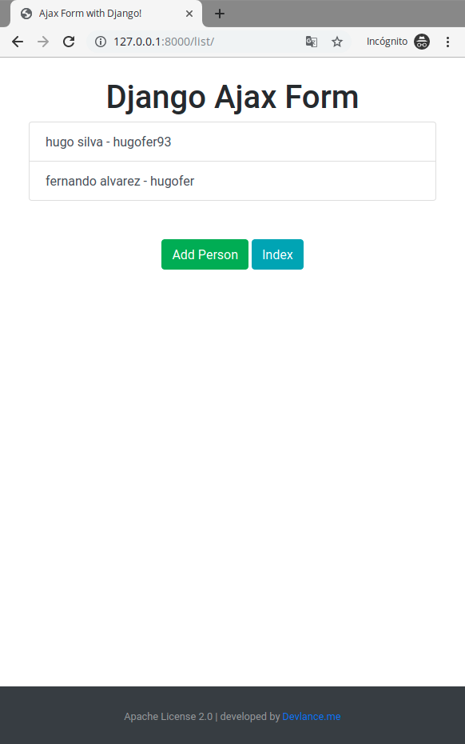
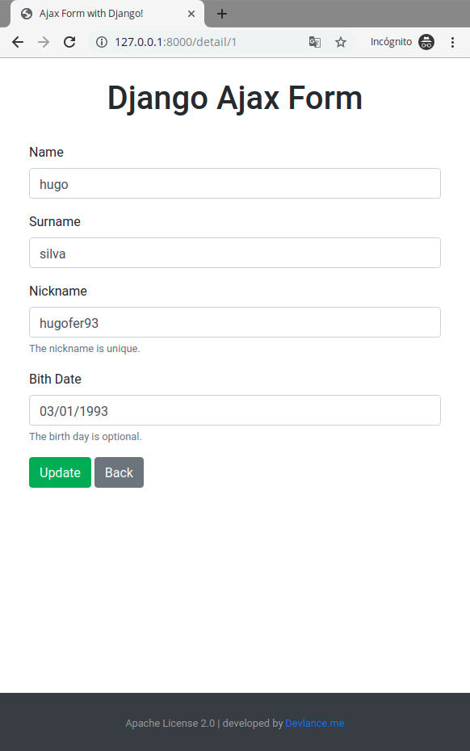
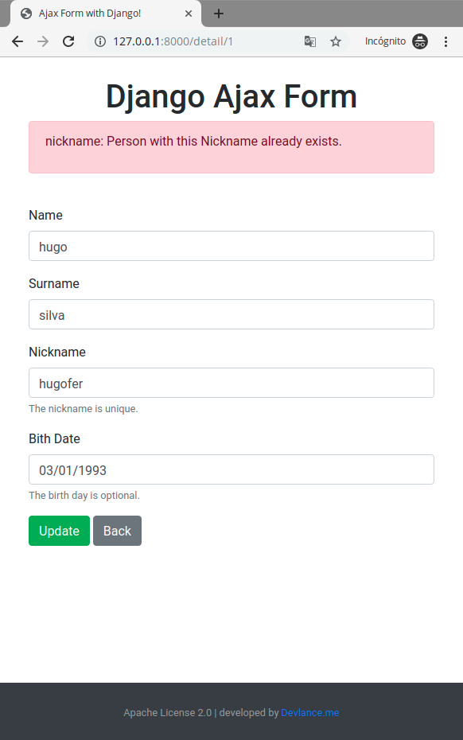
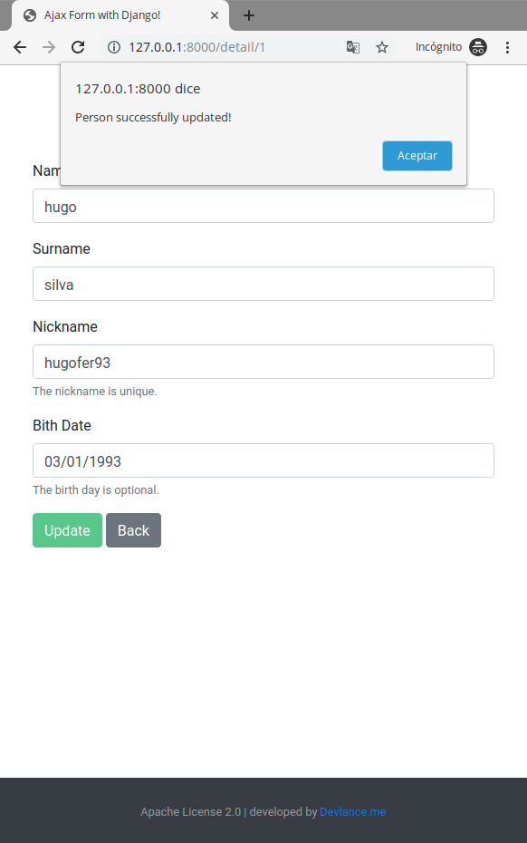

# django ajax form

Sample application to use forms with Ajax / Axios and Class-Based Views

* Django    ~2.2 LTS
* jQuery    ~3.3 Slim
* Bootstrap ~4.3
* Axios     ~0.19

#### Note:
* Class-Based Views
* Render Form (GET Method)
* Submit (POST Method / AJAX)
* CSRF Token Handling (Axios)
* Error Handling and Validations

# Captures:
## Index View

## Create View

## Create View - Bootstrap Datepicker

## Create View - with an error

## Create View - with error in nickname

## Create View - with errors

## Create View - Successfully

## List View

## Detail View

## Detail View - Update Error

## Detail View - Updated Successfully

